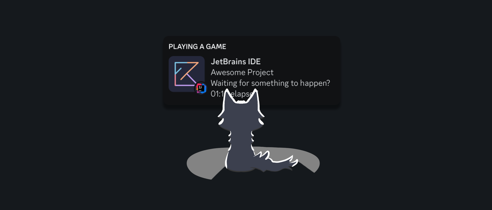

# Cat Activity

<!-- Plugin description -->
Plugin for JetBrains IDE to show your activity in your Discord profile using Catppuccin Icons.
<!-- Plugin description end -->

## Installation

- Using the IDE built-in plugin system:

  <kbd>Settings/Preferences</kbd> → <kbd>Plugins</kbd> → <kbd>Marketplace</kbd> → <kbd>Search for <b>"Cat Activity"</b></kbd> →
  <kbd>Install</kbd>

- Using JetBrains Marketplace:

  Go to [JetBrains Marketplace](https://plugins.jetbrains.com/plugin/24065-cat-activity) and install it by clicking
  the <kbd>Install to ...</kbd> button in case your IDE is running.

  You can also download the [latest release](https://plugins.jetbrains.com/plugin/24065-cat-activity/versions) from
  JetBrains Marketplace and install it manually using
  <kbd>Settings/Preferences</kbd> → <kbd>Plugins</kbd> → <kbd>⚙️</kbd> → <kbd>Install plugin from disk...</kbd>

- Manually:

  Download the [latest release](https://github.com/wavy-cat/Cat-Activity/releases/latest) and install it manually
  using
  <kbd>Settings/Preferences</kbd> → <kbd>Plugins</kbd> → <kbd>⚙️</kbd> → <kbd>Install plugin from disk...</kbd>

## Report a bug

Send any bugs you find to the [Issue](https://github.com/wavy-cat/cat-activity/issues) page. However, if you can fix it,
it would be better to send a [Pull request](https://github.com/wavy-cat/cat-activity/pulls).

## Supported IDE

All of them, including Android Studio. New IDEs or non-JetBrains IDEs do not have their own icon and will use the fallback icon.

JetBrains Gateway, JetBrains Client, and Code With Me Guest are not supported.

## How to request a new icon set?

If you want to suggest an icon set that is not yet included in the plugin (currently only Catppuccin), create a feature request in the Issues section.

Your icon set should preferably have a repository with pairs of the form “file extension (language, full file name) - icon,” for example, as a plugin for another code editor (see the example in the [Catppuccin repository](https://github.com/catppuccin/vscode-icons/blob/main/src/defaults/fileIcons.ts)).
